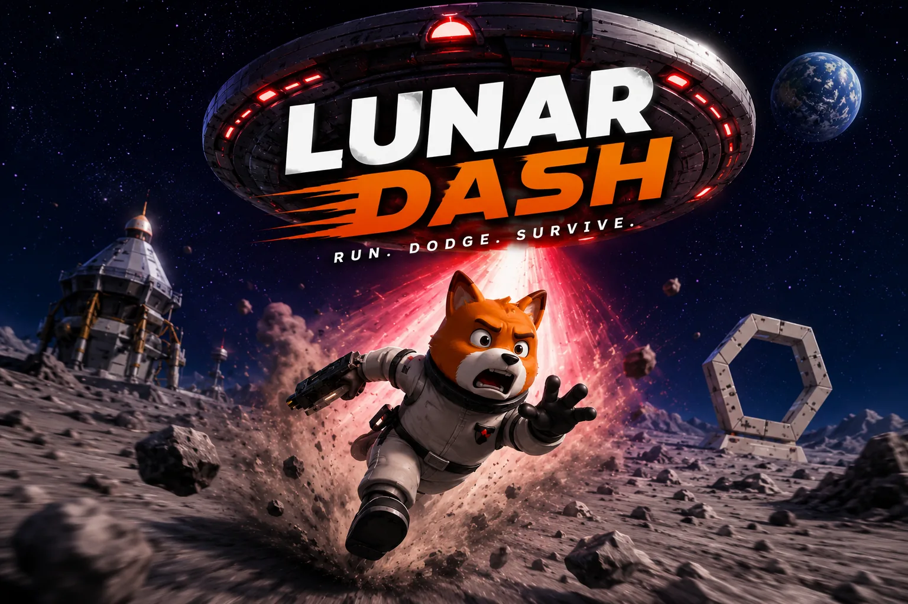
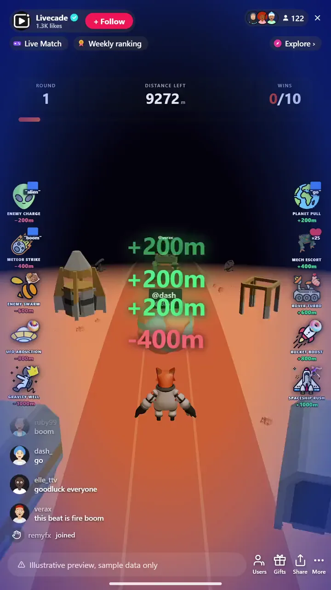

# Lunar Dash - Interactive TikTok Live Game

> Viewers race runners to the finish with boosts and sabotage.

Viewers race side-scrolling characters across the screen. Comments boost speed, gifts unlock abilities, and the leaderboard updates in real time as runners cross the finish line.

**[Play Lunar Dash on Livecade](https://livecade.io/games/lunar-dash/?utm_source=github&utm_medium=readme&utm_campaign=lunar-dash)** - runs as a single browser source in OBS, Streamlabs, or TikTok LIVE Studio. Nothing for viewers to install.

## How viewers play

Viewers take part with the actions TikTok already gives them: **comments**, **gifts**. Every action below is rebindable, so you decide which interaction drives which effect.

| Action | What it does |
| --- | --- |
| **Planet Pull** | Small boost, pushes the runner +200m |
| **Mech Escort** | Boost, pushes the runner +400m |
| **Rover Turbo** | Boost, pushes the runner +600m |
| **Rocket Boost** | Big boost, pushes the runner +800m |
| **Spaceship Rush** | Biggest boost, pushes the runner +1000m |
| **Enemy Charge** | Small setback, knocks a runner back 200m |
| **Meteor Strike** | Setback, knocks a runner back 400m |
| **Enemy Swarm** | Setback, knocks a runner back 600m |
| **UFO Abduction** | Big setback, knocks a runner back 800m |
| **Gravity Well** | Biggest setback, knocks a runner back 1000m |

## How it works

### Viewers control the runners

Every viewer drives a side-scrolling runner. Reactions from chat push their runner forward toward the finish line.

### Boost your own, sabotage the rest

Gifts, likes, and comments trigger boosts that add distance, or setbacks that knock a rival runner back. Bigger effects move the pack more.

### First across the line wins

Cross the finish to trigger a live leaderboard moment. Win a set number of rounds to take the match.

## About the game

Lunar Dash is a frantic side-scrolling race where every viewer controls a runner. Comments give a speed burst, and gifts unlock special abilities like jetpacks and shields.

### A new track every round

The course changes each time and the finish line triggers a live leaderboard moment, so it stays easy to follow on stream without repeating itself.

## What it looks like on stream

[Watch Lunar Dash gameplay](https://cdn.livecade.io/games/lunar-dash.mp4)

## What you can configure

- **Control mode** - Runners advance automatically or on manual triggers
- **Distance to finish** - How far runners race each round, in meters
- **Rounds to win** - How many rounds take the match
- **Background** - Transparent, a solid color, or your own image

## FAQ

<strong>How do viewers join Lunar Dash?</strong>

Every viewer controls a runner straight from your TikTok Live chat. Reactions push their runner forward, so the whole audience is racing at once.

<strong>What is the difference between a boost and a sabotage?</strong>

Boosts add distance to a runner and setbacks knock a rival back. Both come in several sizes, and each one is rebindable to a gift, like, or comment with the amount you choose.

<strong>Does Lunar Dash work for a small stream?</strong>

Yes. It runs with a handful of racers or a full pack, and the side-scrolling view stays easy to follow on stream at any size.

<strong>How do I add Lunar Dash to my TikTok Live?</strong>

Add one browser source URL to OBS or your streaming software and go live. There is no plugin to install and nothing for your viewers to download.

## Setup

1. [Create a Livecade account](https://app.livecade.io/register?utm_source=github&utm_medium=cta&utm_campaign=lunar-dash)
2. Copy your overlay browser source URL
3. Paste it into OBS, Streamlabs, or TikTok LIVE Studio
4. Pick Lunar Dash, set your triggers, and go live

Runs in the browser, so it works on Windows and macOS with nothing to download. [See all TikTok Live games](https://livecade.io/tiktok-live-games/?utm_source=github&utm_medium=readme&utm_campaign=lunar-dash).

---

_This repository documents Lunar Dash, a hosted interactive game by [Livecade](https://livecade.io/?utm_source=github&utm_medium=footer&utm_campaign=lunar-dash). The game runs on Livecade's platform, so there is no source to install here._
